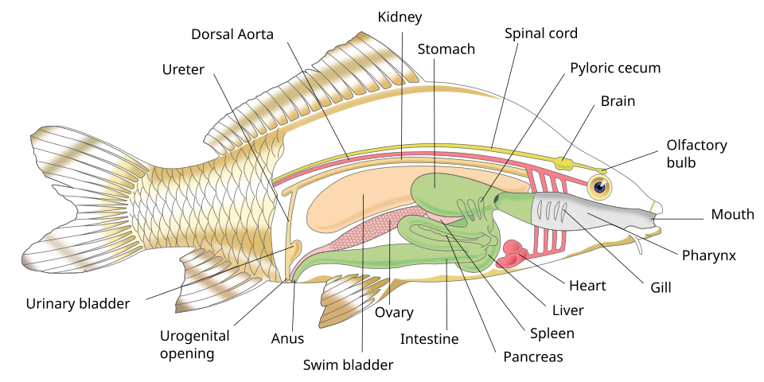
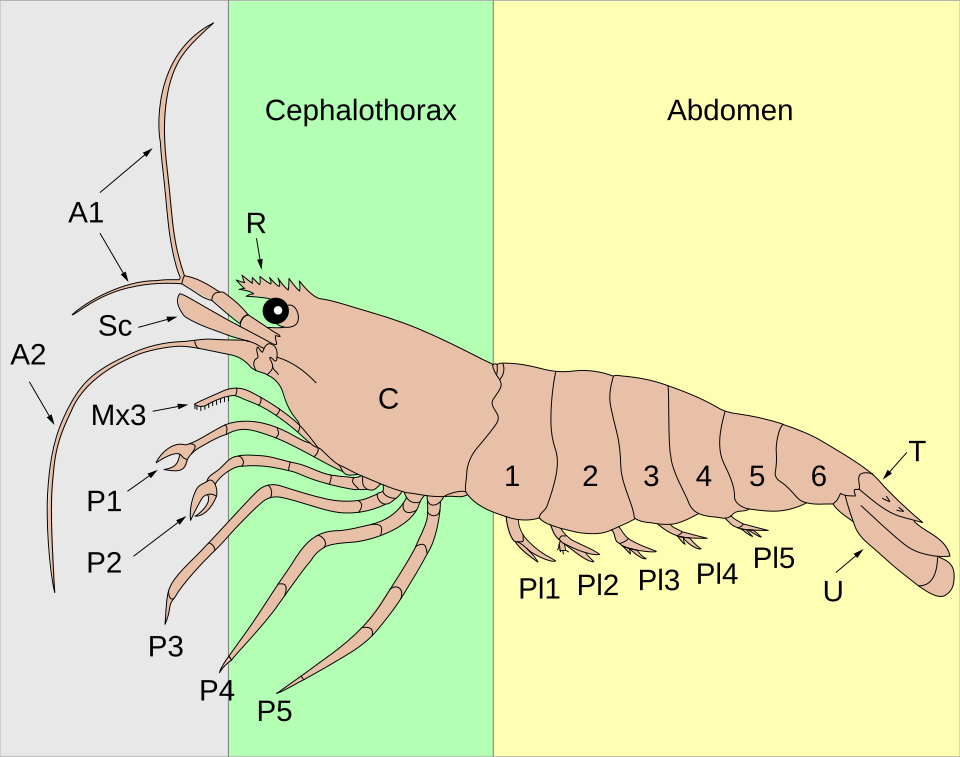

# 魚と甲殻類の体のつくり — 器官の役割、雌雄判別、怪我の回復性

調査日: 2026-04-23

## TL;DR

- 魚は**脊椎動物**の基本構造(心臓・肝臓・腎臓・消化管・中枢神経)に、水中適応のため**鰓・側線・鰾(浮き袋)**を備えた設計。情報の7〜8割は「水の動き」を検出する側線と嗅覚に依存する。
- 甲殻類(十脚類)は**頭胸部+腹部**の二部構造、外骨格を脱皮しながら成長する。内臓の多くは頭胸部の甲の下に詰まっており、**鰓室**が側面にある。
- 雌雄判別は**魚**は二次性徴(ヒレ伸張・体色・生殖突起)、**カニ**は腹部のV字(雄)/半円(雌)が即断指標、**エビ**は腹肢の長さ・卵巣の透け・第一触角の比で見る。
- **回復可能**: 魚はヒレ・ウロコ・皮膚が高い再生能、甲殻類は歩脚・鋏・触角・眼柄が脱皮を経て再生(1〜3回の脱皮で機能回復)。
- **回復不能**: 魚の**内臓損傷**(心臓・腎臓・鰓本体の構造破壊)、ナマズ/ドジョウの**ヒゲ完全根元欠損**。甲殻類は**頭部・尾部・消化器・生殖器**は再生せず、脱皮直前の致命傷も致命的。

---

## 1. 魚の体のつくり

*魚類の内部器官の模式図。Sharon High School / Pixelsquid, Wikimedia Commons, [CC BY-SA 3.0](https://commons.wikimedia.org/wiki/File:Internal_organs_of_a_fish.svg)*

### 1.1 外部構造と主な役割

| 部位 | 主な役割 | 補足 |
|------|---------|------|
| 鰓 (えら) | 呼吸 (水中のO2吸収・CO2排出)、**塩分調節**、食物のろ過 | 4対の鰓弓を鰓蓋で覆う。**塩類細胞**が浸透圧ポンプとして働く |
| 側線 (lateral line) | 水流・振動・圧力変化の検出 | 体側を縦走する管状器官。神経丘 (neuromast) が感覚ユニット。**捕食者の接近や群泳同調**の主要感覚 |
| 鰾 (うきぶくろ) | 浮力調節、**聴覚補助** | コイ・ナマズではウェーバー器官を介して内耳と連絡、音感度が極めて高い |
| 鰭 (ひれ) | 推進・姿勢制御・ブレーキ | 背・尾・臀・胸・腹の5タイプ。**胸鰭がホバリング、尾鰭が推進**の主力 |
| ウロコ (鱗) | 物理的保護、水力学的平滑化 | 真皮由来。**円鱗・櫛鱗・楯鱗**などタイプがある |
| 粘液層 | 抗菌、摩擦低減、浸透圧調節 | 剥がれると即座に感染リスクが上がる |

### 1.2 内部器官

- **心臓**: 1心房1心室の単純構造。全身→鰓→全身の**単循環**。哺乳類のような二循環を持たないため、酸素飽和後すぐ体組織へ向かう。
- **肝臓**: 栄養代謝・解毒・胆汁生成。魚種によっては肝脂肪の貯蔵が著しい (タラなど)。
- **腎臓**: 淡水魚は「大量の水を排出+塩を保持」、海水魚は「水を節約+塩を排出」と戦略が真逆。**頭腎**は造血・免疫の中枢でもある (哺乳類の骨髄相当)。
- **消化管**: 口→咽頭→食道→胃 (無胃魚もいる)→幽門垂→腸→肛門。**幽門垂**は腸の表面積を増やす盲嚢。
- **生殖腺**: 精巣 (雄)・卵巣 (雌)。多くは体腔上部、脂肪体と並ぶ。

### 1.3 感覚の重み

魚の感覚は陸上脊椎動物とはウェイトが違う。優先順位のざっくりしたイメージ:

1. **嗅覚 (匂い)**: 鼻腔の嗅上皮で、水に溶けた分子を検出。サケの母川回帰は嗅覚記憶。
2. **側線 + 聴覚**: 水の振動・低周波。捕食者の接近や群れの同調、産卵期のオス同士の誇示に重要。
3. **視覚**: 種によって色覚あり (4色型も多い)。濁った水ではほぼ役に立たない。
4. **味覚**: 口内だけでなく**体表・ヒゲ・ヒレ**にも味蕾があるナマズ類は「全身が舌」状態。
5. **電気感覚**: サメ・エイ・ナマズ・デンキウナギ類で発達。筋肉の神経電位や地磁気の検出。

### 1.4 雌雄判別

ほとんどの硬骨魚類は体内の生殖腺以外に決定的な外形差がない (**性的一形性**) が、繁殖期や成熟個体では差が出る種が多い。

**一般的な雌雄差のパターン**:

| 特徴 | 雄 | 雌 |
|------|-----|-----|
| 体型 | 細長く俊敏 | 腹部が丸く大型化 (卵のため) |
| 体色 | 派手、婚姻色が出る | 地味 |
| ヒレ | 長く伸張、装飾化 | 短く機能的 |
| 生殖突起 (排泄口後方) | 尖って小さい | 丸く大きい |
| 行動 | 縄張り・求愛ディスプレイ | 受動的選択 |

**代表的な判別例**:

- **グッピー・モーリー**: 雄は**交尾器 (gonopodium)** という変形した臀鰭を持つ。外見で即判別。
- **ソードテール**: 雄は尾鰭下葉が「剣」状に伸長。
- **ベタ**: 雄のヒレが長く流麗、体色鮮やか。
- **コイ (錦鯉)**: 繁殖期の雄は鰓蓋や胸鰭に**追い星 (ブツブツの白点)** が出る。
- **サケ科**: 繁殖期の雄は顎が鉤状に伸びる (kype)。
- **ヨシノボリ属 (Rhinogobius)**: 雄の第一背鰭が高く伸張、雌は低く丸い。生殖突起の形状差も顕著。

**判別が難しい種**:

- コイ・フナなど **非繁殖期のコイ科**は外観差がほぼない。
- タイ・アジの類も解剖してみないとわからないことが多い。
- **性転換する種** (ハタ・ベラ・クマノミ) は生涯で性別が変わるため、その時点のスナップショットでは判別しても意味が薄い。

### 1.5 回復可能な怪我 vs 回復不可能な怪我

**回復可能**:

| 部位 | 回復期間の目安 | 条件 |
|------|--------------|------|
| ヒレの裂け・欠け | 数日〜2ヶ月 | 基部が残っていれば再生、深い欠損は2ヶ月前後 |
| ウロコの剥がれ | 数日〜数週間 | 小範囲なら1週間、広範囲は1〜2ヶ月 |
| 体表の擦り傷・浅い裂傷 | 1週間以内 | 水質良好が前提、二次感染が最大の敵 |
| 皮膚の深い裂傷 | 1〜2ヶ月 | 真皮再生はTITECHが2018年に**脱分化を経ないメカニズム**を解明 |
| 尾鰭の大きな欠損 | 2ヶ月程度 | **ブラステマ細胞**が元形を記憶して復元 (東北大2021) |

**回復不可能**:

- **鰓弁の構造破壊**: 再生限界を超えた物理損傷で呼吸能が永続低下。
- **内臓 (心臓・腎臓・肝臓) の深い損傷**: 再生能はあるが、構造破壊されると致死的。
- **中枢神経の損傷**: 一部再生例はあるが、部位によっては機能回復せず。
- **ナマズ・ドジョウのヒゲの根元欠損**: 根元 (ヒゲ基部の皮膚下組織) が残っていないと再生しない。味覚・触覚を失って衰弱することが多い。
- **眼球破裂**: 魚は基本的に眼そのものは再生しない (眼そのものを丸ごと失う甲殻類とは対照的)。
- **背骨の折れ・歪み**: 奇形化したまま定着し、泳ぎに支障が残る。

再生を支えるカギは**水質・水温・粘液**の3点で、どれかが崩れると二次感染が先行して本来治る傷が治らなくなる。

---

## 2. 甲殻類 (十脚目) の体のつくり

*エビの外部形態ラベル図 (A1/A2: 触角、C: 甲、P1-P5: 歩脚、Pl1-Pl5: 遊泳肢、U: 尾肢、T: 尾節)。Fred the Oyster, Wikimedia Commons, [CC BY-SA 4.0](https://commons.wikimedia.org/wiki/File:Anatomy_of_a_shrimp_(colour).svg)*

### 2.1 基本体制

十脚類 (エビ・カニ・ザリガニ) は20体節を持ち、次の2部構造にまとまる。

- **頭胸部 (cephalothorax)**: 頭と胸が融合。背面を**甲 (carapace)** が覆う。内臓のほとんどがここに詰まっている。
- **腹部 (pleon / abdomen)**: エビでは発達 (遊泳筋)、カニでは縮退して甲下に折り畳まれる、ザリガニは中間。

付属肢は次の通り。「decapoda = 十脚」はこのうち胸脚5対を指す。

| 付属肢 | 数 | 役割 |
|--------|-----|------|
| 第1触角 (antennule) | 1対 | 嗅覚 (化学受容毛を持つ) |
| 第2触角 (antenna) | 1対 | 触覚・機械受容、長く伸びる |
| 大顎・小顎 | 3対 | 摂食 |
| 顎脚 (maxilliped) | 3対 | 摂食補助・選別 |
| **胸脚 (pereiopod)** | 5対 | 第1対=**鉗脚 (cheliped, ハサミ)**、残り4対=歩脚 |
| 腹肢 (pleopod, swimmeret) | 5対 | 遊泳・抱卵・生殖 |
| 尾肢 (uropod) + 尾節 (telson) | 1対+1 | **尾扇**を構成、逃避時の後退ジャンプ |

### 2.2 内部器官

- **心臓**: 背側・頭胸部後方の**心嚢**内。**開放血管系** (血液=ヘモリンパが体腔を満たす)。酸素運搬は**ヘモシアニン** (銅ベース、**青い血**)。
- **鰓 (gill)**: 甲の側縁が覆う**鰓室**内に胸脚基部由来で並ぶ。水流は顎脚基部のポンプで作る。
- **消化系**: 口→食道→**前胃 (gastric mill, 胃磨)**→中腸→後腸→肛門。前胃はキチン質の歯で食物を機械的にすり潰す「胃の中の歯」で、甲殻類ならでは。
- **中腸腺 (肝膵臓, hepatopancreas)**: 脂肪・栄養を大量に貯め、味噌・カニ味噌の正体。肝臓+膵臓の機能を兼ねる。
- **神経系**: 脳は小さく、各体節に**神経節**が並ぶ**はしご状神経系**。嗅覚処理に脳の約40%を使う。
- **生殖腺**: 頭胸部後部に精巣/卵巣。雌の卵巣は熟すと鮮やかなオレンジで甲を透かして見えることがある。

### 2.3 雌雄判別

**カニ (Brachyura) の瞬時判別**:

裏返して腹部 (褌) を見る。これだけで即断できる。

- **雄**: 腹部が**V字・細長い三角形** (「褌が狭い」)
- **雌**: 腹部が**半円〜幅広の扇状** (卵を抱くための構造)

加えて、雄の腹部内側には**G1・G2 (生殖肢)** 2対しか残らず、雌は4対の腹肢が残りブラシ状の毛で卵を保持する。これは同定にも使う決定形質で、サワガニ科では**G1末端部の形状**が種判別のキーになる。

**エビの判別** (ヌマエビ・ヤマトヌマエビ等で観察しやすい):

| 特徴 | 雄 | 雌 |
|------|-----|-----|
| 体サイズ | 小さく細め | 大きく腹部が丸い |
| 第1触角 | 長く目立つ | 短め |
| 腹肢 | 短い | 長くフリル状 (抱卵のため) |
| 腹節下側の膨らみ | 平 | 下方に膨らむ (卵ポケット) |
| 卵巣の透け | なし | 成熟時は頭胸部背面がオレンジ色に透ける |
| 第2腹肢内肢 | 雄性付属肢 (appendix masculina) 付き | なし |

**ザリガニ・ロブスター**:

- 雄は**第1・第2腹肢が硬く細長く**前方へ突き出す (精子輸送器)。
- 雌は腹肢が柔らかく均一な房状。生殖孔の位置も異なる (雄は第5胸脚基部、雌は第3胸脚基部)。

### 2.4 自切と再生 — 甲殻類の特異能力

甲殻類は**捕食者に肢を掴まれた時、自ら切り落として逃げる**能力を持つ (autotomy, 自切)。切断面は関節の**決まった位置 (breakage plane)** にあり、血液が漏れないよう膜が即座に閉じる。

再生は**脱皮 (molting) を経由してのみ**起こる。これは外骨格に縛られた構造的制約で、脱皮なしには体サイズも付属肢も変えられない。

**再生可能**:

| 部位 | 再生脱皮数 | 備考 |
|------|-----------|------|
| 歩脚 | 1〜2回 | 単純構造なので比較的速い |
| 鉗脚 (ハサミ) | 2〜3回 | 大きく複雑で時間がかかる |
| 触角 | 1〜2回 | 短いものから順に復元 |
| 眼柄 (と眼) | 1〜2回 | 魚が眼を失うと終わりなのと対照的 |

若い個体は数日〜数週間、成体は数ヶ月〜数年。**自切した個体は脱皮間隔が短縮**する傾向があり、エネルギーを再生に振り分ける。再生した肢は最初は小さく、数回の脱皮を経て元サイズに戻る。ただし**再生した肢は元より小さく、機能も劣る**ことが多く (ロブスターの主鋏で30〜40%、カニでは**脱皮1回の成長増分が25%低下**する事例がある)、サイヴァーサル・コストは大きい。

**再生不可能**:

- **頭部**: 切り落とされたら終わり。
- **尾部 (尾節・尾扇)**: 構造的に再生しない。
- **消化器 (前胃・中腸腺)**: 内部器官は再生能が極めて低い。
- **生殖器**: 再生しない。
- **脱皮直前・直後の致命傷**: 外骨格が柔らかい時期に傷を負うと、硬化前に失血・感染で死亡する。

### 2.5 脱皮という「生き方そのもの」

甲殻類にとって脱皮は成長のイベントであり、同時に**最も危険な瞬間**。脱皮中は動けず、外骨格が柔らかい数日間は捕食・共食いリスクが最大になる。再生も脱皮に縛られているため、自切した個体が次の脱皮で死ねば再生も叶わない。

脱皮頻度は幼体で頻繁 (数日〜週)、成体で数ヶ月〜年1回と低下する。**老齢個体は脱皮しなくなる**種もあり、この場合は付属肢の再生もできなくなる。

---

## 3. まとめ比較表

| 項目 | 魚 | 甲殻類 (十脚類) |
|------|------|-----------------|
| 体制 | 脊椎動物、頭+胴+尾 | 節足動物、頭胸部+腹部 |
| 呼吸 | 鰓 (側面の鰓蓋下) | 鰓 (甲下の鰓室) |
| 骨格 | 内骨格 (脊椎・肋骨) | 外骨格 (キチン+炭酸カルシウム) |
| 成長 | 連続的 | 不連続 (脱皮) |
| 血液 | ヘモグロビン (赤) | ヘモシアニン (青) |
| 浮力調節 | 鰾 | なし (遊泳肢や密度調節) |
| 主感覚 | 側線+嗅覚 | 嗅覚 (脳の40%) +機械受容 |
| 雌雄差 | 繁殖期の体色・ヒレ差 | 腹部形状・生殖肢 (G1/G2) |
| 皮膚再生 | 速く脱分化を経ない | 脱皮を経由 |
| 肢/付属肢再生 | ヒレは再生、眼は再生しない | 脚・鋏・触角・眼柄すべて再生 |
| 内臓再生 | 限定的 | ほぼ不可 |

---

## 自分のプロジェクトへの影響・活用

- **ヨシノボリ属研究**: 雌雄判別 (第一背鰭・生殖突起・婚姻色) の基礎、ヒレの再生能の把握 (個体識別でヒレクリップを使う場合、再生速度から再採集までの期間が読める)。
- **甲殻類DB (biology/crustacea-freshwater-brackish)**: 既存の 05-morphology-identification.md と同じ形質記述体系 (G1/G2、腹部V字など) を使っており整合する。本稿は「魚と並べた比較」という横断視点を与える。
- **在野観察の手技**: 生きたまま雌雄判別 → リリース、という非侵襲のワークフローを組む際のリファレンスとして機能する。

---

## 出典

### 魚の体のつくり

- [魚類 - Wikipedia](https://ja.wikipedia.org/wiki/%E9%AD%9A%E9%A1%9E) — 全体像の基礎
- [鰾 - Wikipedia](https://ja.wikipedia.org/wiki/%E9%B0%BE) — 浮き袋の機能とウェーバー器官
- [魚の体の仕組みを見てみよう｜内臓の構造と機能 | Theフナ](https://hunassius.com/3387/) — フナベースの内部器官解説
- [魚の解剖学 – HiSoUR](https://www.hisour.com/data/fish_anatomy/) — 網羅的概説
- [浮き袋の進化 (遺伝研 2017)](https://www.nig.ac.jp/nig/images/research_highlights/PR20170203.pdf) — 背側/腹側遺伝子スイッチの発見
- [魚の再生能力とは｜東京アクアガーデン](https://t-aquagarden.com/column/fish_self_healing) — 回復可能/不可能な怪我の切り分け
- [魚の完全な皮膚再生システムを解明 | 東工大ニュース (2018)](https://www.titech.ac.jp/news/2018/041321) — 脱分化を経ない皮膚再生メカニズム
- [魚は切られたヒレの長さを分かっている | Tohoku University](https://www.lifesci.tohoku.ac.jp/en/date/detail---id-49182.html) — 尾鰭再生の元形復元機構
- [Sexual dimorphism - Wikipedia](https://en.wikipedia.org/wiki/Sexual_dimorphism) — 性的二形の総説
- [Gender Reveal: Fish – Greater Cleveland Aquarium](https://www.greaterclevelandaquarium.com/gender-reveal-fish/) — 飼育下の雌雄判別まとめ

### 甲殻類の体のつくり

- [甲殻類 - Wikipedia](https://ja.wikipedia.org/wiki/%E7%94%B2%E6%AE%BB%E9%A1%9E) — 全体像
- [食卓で学ぶ甲殻類のからだのつくり (広島大)](https://ir.lib.hiroshima-u.ac.jp/22762/files/15735) — 教育的に優れた解剖解説
- [カニのオスとメスの見分け方 - なにわ海洋生物研究所](http://naniwa-marine.seesaa.net/article/98402021.html) — 腹部V字/半円の判別
- [ミナミヌマエビの雄雌の見分け方](https://mizukusasuisou.com/male-and-female-of-minaminuma-shrimp/) — エビの判別実務
- [Detailed Guide to Regeneration in Crustaceans | Shrimp and Snail Breeder](https://aquariumbreeder.com/detailed-guide-to-regeneration-in-crustaceans/) — 再生可能/不可能部位、脱皮サイクルとの関係
- [Autotomy of the major claw stimulates molting | ScienceDirect](https://www.sciencedirect.com/science/article/abs/pii/S0022098118300595) — 自切と脱皮サイクルの関係
- [Patterns of Limb Loss in the Blue Crab](https://www.researchgate.net/publication/233574571) — 再生コストの定量データ
- [Melatonin Promotes Cheliped Regeneration in Eriocheir sinensis](https://pubmed.ncbi.nlm.nih.gov/29623051/) — チュウゴクモクズガニの鋏再生
