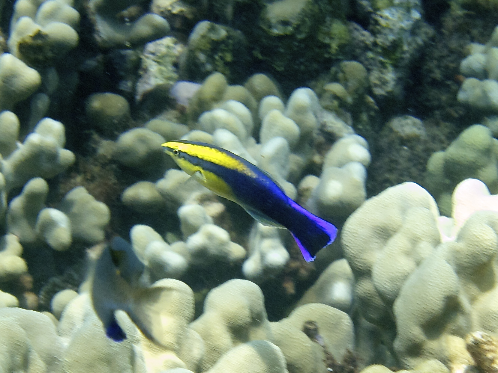

# 魚と甲殻類の知能と行動 — わかっていること/わかっていないこと

調査日: 2026-04-23

## TL;DR

- **魚は「冷たく機械的」な生き物という固定観念は2010年代以降の実験群で崩れた**。ホンソメワケベラは鏡像自己認識テストに合格 (PNAS 2023、Sci Rep 2026)、ハタはウツボと**ジェスチャーで呼びかけて協力狩り**を行う、シクリッドは**玩具遊び**をする、等。
- **魚の痛覚**はnociceptor・オピオイド系・鎮痛剤応答・学習的回避がそろい、**痛みを感じている**という見解が主流 (米国獣医師会も認知)。
- **甲殻類 (十脚類) も痛覚を持つ**という証拠が強く、2022年に**英国の動物福祉法**が十脚類を感覚能力保有生物として公式認定。
- **甲殻類の知能**は、空間記憶・個体顔認識 (ザリガニ)、貝殻交換の**社会的順番待ち**(ヤドカリ)、**シャコのストライク対話**などが判明。ただし魚ほど「遊び」の明確な報告は少ない。
- **わかっていないこと**: 魚の主観的感情の質、甲殻類の痛みの「体験」の強度、多くの種での個体間コミュニケーションの全容、野外での本当のライフタイム行動。

---

## 1. 魚の知能と行動

*ハワイアンクリーナーラス *Labroides phthirophagus*。ホンソメワケベラ属は鏡像自己認識テストに合格したことで知られる。Wikimedia Commons, [CC BY-SA 4.0](https://commons.wikimedia.org/wiki/File:Hawaiian_cleaner_wrasse.jpg)*

### 1.1 わかっていること

#### 鏡像自己認識 (MSR) — 魚類で初めて合格した「頭足類未満」の脊椎動物

ホンソメワケベラ (*Labroides dimidiatus*) は、喉元にマークを付けて鏡を見せる古典的な**マークテスト**に合格した最初の魚。大阪市立大学・幸田正典らによる一連の研究で、2019年以降複数の追試が進み、2023年には PNAS に「**自己の顔を鏡像として認識している**」ことを示す論文が掲載された ([PNAS 2023](https://www.pnas.org/doi/10.1073/pnas.2208420120))。

2026年2月には大阪公立大学グループが追試に成功し、マーク除去行動が平均**82分以内**に現れることを確認。従来実験では4〜6日かかっていたのが大幅短縮した ([Sci Rep 2026](https://www.nature.com/articles/s41598-025-25837-0))。この短縮は、鏡を「自己を見る道具」と理解するまでの時間が実は短く、それまでの長さは実験パラダイム側の問題だったと示唆する。

#### 道具使用とコミュニケーション

**ハタ (grouper) とウツボ (moray eel) の協力狩り**: 2006年に Bshary らが報告し (PLOS Biology、[Bshary et al. 2006](https://journals.plos.org/plosbiology/article?id=10.1371/journal.pbio.0040431))、ハタが**身体を震わせて呼び出し**、岩陰の獲物をウツボに追い出させる。ハタは開水域で高速、ウツボは裂け目で細身、という**役割分担**がある。ハタ単独の5倍近い狩猟効率になる。さらにハタは**頭を下にして頭振り**で「獲物はここにいる」と**参照的ジェスチャー**で示す。ヒトの指差しに相当する動作が魚で成立する。

**モンガラカワハギ類はウニの裏返し**、**ベラの仲間はサンゴを金床にして貝を割る**など、少なくとも道具使用的行動が複数種で報告されている。

#### 社会認知と戦術的欺瞞

ホンソメワケベラはクライアント魚を**粘液を食うか寄生虫を食うか**で騙す/信頼を積む、**推移的推論** (A>B, B>C → A>C) を解く、**自己抑制 (delay of gratification)** ができる、といった研究がある。

#### 遊び行動

**シクリッド *Tropheus duboisi***: Burghardt らが2年間の観察で、水槽の底錘つき温度計を**繰り返し突く**行動を個体ごとに異なるスタイルで示すことを記録 (Ethology 2015, [DOI](https://onlinelibrary.wiley.com/doi/10.1111/eth.12312))。食や繁殖や闘争と無関係、リラックスした状態で起きる反復行動=**遊び**の定義に合致する。

**モンガラ・フグ・マンタ**: 水流で遊ぶ、落ち葉を追いかける、泡を作って遊ぶといった逸話的報告が多い。

#### 感情と痛覚

- **痛覚**: 魚の体表にはA-δ線維様・C線維様のnociceptorがあり、火傷や酢、蜂毒などに反応して体をこすりつける・摂餌停止などの回避行動を示す。**モルヒネで回避行動が正常化**することから、単なる反射ではなく「**苦痛の主観的体験**」が推測される ([Pain in fish - Wikipedia](https://en.wikipedia.org/wiki/Pain_in_fish))。
- **情動**: 恐怖・ストレス応答はコルチゾール上昇・行動変化として検出可能。ポジティブな情動 (期待・喜び相当) の証拠も蓄積中。
- **米国獣医師会 (AVMA)** は「陸上脊椎動物と同等の痛み配慮を受けるべき」という立場 ([CIWF Fish Sentience Report](https://www.ciwf.eu/media/7437870/why-fish-welfare-matters_the-evidence-for-fish-sentience_ciwf-2019.pdf))。

#### コミュニケーション

- **音声**: フエダイ・ハゼ・ナマズ・ヨウジウオ等は浮き袋や骨の摩擦で発音する。縄張り・求愛・警戒の signals。
- **視覚**: 体色変化、鰭の誇示、姿勢。闘魚ベタの誇示は典型。
- **化学**: フェロモン、警報物質 (Schreckstoff)。キンギョやナマズは傷ついた同種の匂いで群れが一斉に散らばる。
- **電気**: デンキウナギ・デンキナマズ・モルミルス類は電場でコミュニケーションする。

#### 個体識別と記憶

- グッピーは**同種個体を顔で見分ける**。
- 一部のコイ・金魚は**数ヶ月〜年単位の空間記憶**を持ち、給餌時刻・場所を学ぶ。
- ゼブラフィッシュは**数的概念** (3 vs 4) の弁別ができる。

### 1.2 わかっていないこと

- **主観的体験 (クオリア) の質**。痛みや喜びを「どう感じている」かは原理的に実験で到達しにくい。
- 多くの野生種での個体間コミュニケーションの全体像 (研究対象は少数のモデル種に偏っている)。
- 遊びの進化的起源と汎用性 (現在の証拠はシクリッド・フグ等の限定的事例)。
- 睡眠と夢のような内的状態。
- 種間で大差のある知能の原因 (脳構造? 社会性? 生態?)。

### 1.3 生態と一生

魚のライフサイクルは基本 **卵 → 仔魚 (larva) → 稚魚 (fry) → 幼魚 (juvenile) → 成魚 (adult)** の5段階。詳細は種により多様。

| 段階 | 特徴 |
|------|------|
| 卵 | 水中に放出 (放卵型) / 口内保育 / 粘着卵として付着 等。種により数十〜数百万 |
| 仔魚 | 卵黄嚢でエネルギー自給。まだヒレ・ウロコ未完成 |
| 稚魚 | 卵黄吸収後、自力摂餌開始。遊泳力獲得 |
| 幼魚 | 成魚と同じ形になる「変態」。体色・鰭・ウロコが整う |
| 成魚 | 性成熟、繁殖 |

**寿命の幅**:

- **数週間〜数ヶ月**: 小型クジラウオ類、アイテム的な短命種 (*Nothobranchius*) は8週間で世代交代
- **1〜3年**: 多くの小型淡水魚 (ハゼ科・メダカ)
- **数十年**: 錦鯉 (30〜70年)、多くのサメ・マグロ
- **100年超**: シーラカンス、ニシオンデンザメ (400年説もある)

繁殖戦略も多様で、**一回繁殖型 (サケは産卵後死亡)** から**長期反復繁殖型** (コイ・錦鯉) まで。性転換する種 (クマノミ・ハタ・ベラ) も多数。

---

## 2. 甲殻類 (十脚類) の知能と行動

### 2.1 わかっていること

#### 痛覚と感覚能力 (sentience)

**決定的に流れが変わったのは2021年**、Jonathan Birch らがロンドン・スクール・オブ・エコノミクスで発表した**108ページの総説**で、十脚甲殻類と頭足類が**感覚能力 (sentience) の8基準**を多くの場合満たすことを示した。

- **nociceptors** (痛覚受容器)
- **統合脳領域** (単なる反射中枢でない)
- **nociceptor中枢の結合**
- **オピオイド様鎮痛の効果** (モルヒネで回避緩和)
- **有害刺激を避ける学習の動機づけ**
- **モチベーション同士のトレードオフ** (強い痛みの回避が優先される)
- **保護的運動反応** (傷口を守る、擦る)
- **苦痛と関連する連合学習**

十脚類 (カニ・エビ・ザリガニ) はすべて満たすか、強い証拠がある、とされた。**Crustacean Hyperglycaemic Hormone (CHH)** がコルチゾール類似の役割でストレス時に上昇する、オピオイド受容体 (μ, κ, δ) がヒトとほぼ同一配列で存在する、といった分子レベルのエビデンスも揃う ([Pain in crustaceans - Wikipedia](https://en.wikipedia.org/wiki/Pain_in_crustaceans))。

**2022年に英国**が Animal Welfare (Sentience) Act で十脚類と頭足類を**感覚能力保有生物と正式認定**した。政策的なインパクトが大きく、沸騰調理の是非や麻酔使用の議論に直結している。

#### 学習と個体認識

- **ザリガニ (*Procambarus clarkii*, *Cherax destructor*)**: 迷路学習、**闘争相手の顔を視覚的に覚える**([PLOS ONE 2007](https://journals.plos.org/plosone/article?id=10.1371/journal.pone.0001695))。同じ相手と再戦すると順位関係を思い出す。
- **カニ類**: 視覚的形状認識、捕食者のシルエット識別、罠学習 (一度つかまった罠を避ける)。
- **ヤドカリ**: 貝殻の「内見」(触肢で内部を測る)、選好の序列付け。

#### 社会性とコミュニケーション

- **ヤドカリ (*Pagurus bernhardus* ほか)**: **貝殻交換の順番待ち行列 (vacancy chain)** が成立する。大きな貝殻が空くと、それに合う次の個体、さらに次、と玉突きで全員がアップグレードする。集まって**ピギーバック** (体を重ねる) し、抜けた主の貝殻を取り合う。
- **Shell rapping** (殻叩き): 奪う側が相手の殻を自分の殻で打ち鳴らし、中の個体を追い出そうとする。打ち鳴らしの**回数・強度**で相手が降参するかが決まる一種の交渉手段 ([Royal Society B 1998](https://royalsocietypublishing.org/doi/10.1098/rspb.1998.0459))。
- **シオマネキ**: ハサミを振って求愛・縄張り主張。**ハサミの振幅・頻度**で個体識別される。
- **シャコ (mantis shrimp)**: 縄張り闘争で互いの**テルソン (尾盾)** を叩き合う「スパーリング」。ダメージを抑えて順位決定する儀式化した戦闘。
- **stridulation (摩擦発音)**: ヤドカリ・イセエビ・ロブスター等は鋏・脚・触角基部をこすって音を出す。6〜8kHzで威嚇や逃避時に発音。

#### コミュニケーションの主要チャネル

| チャネル | 役割 | 代表例 |
|---------|------|-------|
| 嗅覚・化学 | 個体認識・性フェロモン・尿によるシグナル | ロブスターは**尿で社会的情報**を送る |
| 視覚 | ディスプレイ、ハサミ振り | シオマネキ、シャコ |
| 振動・音 | 威嚇、縄張り | ヤドカリの殻叩き、シャコの脚振動 |
| 機械的接触 | 闘争のスパーリング | シャコのテルソン叩き合い |

#### 狩りの駆け引き

- **シャコ**: 視覚で位置を測り、パンチ速度 (水中で時速80km相当) と正確さで貝殻を割る。何度叩くと割れるかも個体差で学習される。
- **カニ**: 待ち伏せ型と追跡型が種別にある。タラバガニ類は社会的階層を踏まえて獲物優先度を決める。
- **ヤドカリ**: デトリタス食が多く、狩りの駆け引きは控えめだが、**同種との食物奪い合い**で駆け引きがある。

#### 遊び?

甲殻類の「遊び」の明確な報告は魚より少ない。ザリガニ・ロブスター・カニで**機能不明の物体操作**が散発的に観察されているが、確立した事例はない。**脳構造 (はしご状神経系)** とエネルギーコスト (脱皮サイクル) から見ると、遊びに割く余裕は限られると思われる。

### 2.2 わかっていないこと

- **主観的痛みの強度**: 感覚能力はあるが「ヒトと同等の苦痛か」は未解決。
- **多種でのコミュニケーション網**: ヤドカリ・シャコ以外の種で社会交渉の詳細はほとんど未記載。
- **記憶の上限**: ザリガニで数日の空間記憶は示されたが、年単位の記憶や場所学習は未検証種が大半。
- **遊びの存在**: 明瞭な反復遊びの記録が少ない。技術的な観察不足か、本当にしないのか不明。
- **野外での生涯行動記録**: 特に深海性・底生性種は基本的なライフログすら未収集。

### 2.3 生態と一生

十脚類のライフサイクルは、多くの種で**プランクトン性幼生** を経る複雑な変態を伴う。

| 段階 | 形態・特徴 |
|------|---------|
| 卵 | 雌の腹肢に抱卵。数日〜数週間で孵化 |
| ノープリウス (nauplius) | 一部の種のみ (エビ類の一部)。3対の付属肢のみ |
| ゾエア (zoea) | 胸脚で遊泳、背に大きな棘。プランクトン生活 |
| メガロパ (megalopa) | 腹肢で遊泳、すでに「カニ型」に近い |
| 稚個体 (juvenile) | 底生生活に移行 |
| 成体 (adult) | 性成熟、繁殖。脱皮を繰り返しながら成長 |

**ゾエア→メガロパ→稚個体**は典型的なカニ類のパターン。エビ類はゾエア的幼生を経ることが多いが、ミナミヌマエビのように**卵から小さな成体形 (親と同形)** で孵る**直接発生種**もある (そのため淡水で完結可能)。

**寿命**:

- **数ヶ月〜1年**: 小型エビ (サクラエビ・ホッコクアカエビの一部)
- **1〜3年**: モクズガニ、ヤマトヌマエビ、ミナミヌマエビ
- **5〜15年**: サワガニ (長寿種の一つ)
- **30年以上**: イセエビ、ロブスター、タラバガニ
- **50年以上**: ヨーロッパアメリカオマールロブスターは**理論上はほぼ不死**と言われた時期があった (老衰死ではなく、脱皮コストによる死亡が増加して結果的に長く生きれない)。

性決定・性転換は種で多様で、**ホルモン操作で可逆的に性が変わる**種 (スナガニ類) や、**雌雄同体** (一部のエビ)、**単為生殖可能** (ザリガニの一部) まで幅広い。

---

## 3. まとめ比較表

| 項目 | 魚 | 甲殻類 (十脚類) |
|------|------|-----------------|
| 痛覚の証拠 | 強い (AVMA認知) | 強い (英国2022年法認知) |
| 鏡像自己認識 | ホンソメワケベラで合格 | 報告なし |
| 道具使用 | あり (貝を岩で割るベラ等) | 明瞭な報告はヤドカリの殻以外に少ない |
| 協力行動 | 異種間協力狩り (ハタ+ウツボ) | 階層社会の駆け引き (シャコ・ヤドカリ) |
| 遊び | 物体操作遊び (シクリッド) | 明瞭な報告少ない |
| 個体認識 | グッピー、ホンソメワケベラ | ザリガニで顔認識 |
| 記憶 | 年単位の空間記憶 | 数日〜週単位 |
| コミュニケーション | 音・視覚・化学・電気 | 化学・視覚・振動・機械接触 |
| 変態 | 連続的な発育 | ゾエア・メガロパ等の劇的変態 |
| 寿命 | 数週〜400年 | 数ヶ月〜50年+ |

---

## 4. 視点: なぜ「わかっていない」が多いのか

魚と甲殻類の認知研究が哺乳類・鳥類に比べて遅れた理由は主に3つ。

1. **擬人化への警戒**: 「水中の冷血動物」という擬人化回避バイアスで、**感情や痛覚の存在を主張する論文が長らく受理されにくかった**。
2. **実験パラダイムの制約**: 哺乳類・鳥類用に最適化された知能テスト (鏡像・数的認知・道具使用) が水中適応された動物には不向きなことが多く、**ネガティブ結果が正しく解釈されなかった**。ホンソメワケベラで鏡像テストの「喉マーク」を考案したのが突破口。
3. **福祉観の後発**: 畜産・水産の経済動物としての位置づけが強く、**動物福祉の議論が魚・甲殻類に及んだのは21世紀に入ってから**。英国の2022年法、EU の議論、US AVMA の姿勢はいずれも最近のパラダイム変化。

この結果、**既存の多くの「できない」は「まだできる証拠が見つかっていない」かもしれない**、という状態が続いている。

---

## 自分のプロジェクトへの影響・活用

- **ヨシノボリ属の行動観察**: 側線と視覚による同種識別、雄同士の縄張り争いのサイン解析の一般的枠組みを得た。**「魚も個体識別する」「痛覚を持つ」**というベースラインは論文執筆時のエシクス記述や研究設計に使える。
- **甲殻類DB**: 同定・生態の既存資料の延長として「行動・認知」の章を立てる際の出発点。特にヤドカリの vacancy chain は淡水/汽水産ではなくとも参照価値が高い。
- **在野研究者としての姿勢**: 「まだ誰も検証していない当たり前の行動観察」が論文の核になりうる。ヨシノボリ属の個体識別・求愛駆け引きの詳細記録には、まだ発表価値のある空白が多い。

---

## 出典

### 魚の知能・行動

- [Cleaner fish recognize self in a mirror via self-face recognition (PNAS 2023)](https://www.pnas.org/doi/10.1073/pnas.2208420120) — 鏡像自己認識の決定的論文
- [Rapid self-recognition ability in the cleaner fish (Sci Rep 2026)](https://www.nature.com/articles/s41598-025-25837-0) — マーク除去82分の追試
- [Cleaner fish show intelligence typical of mammals | 大阪公立大学](https://www.omu.ac.jp/en/info/research-news/entry-103609.html) — 日本語プレスリリース
- [Interspecific Communicative and Coordinated Hunting (PLOS Biology 2006)](https://journals.plos.org/plosbiology/article?id=10.1371/journal.pbio.0040431) — ハタ+ウツボ協力狩りの原著
- [Groupers Use Gestures to Recruit Morays (National Geographic)](https://www.nationalgeographic.com/science/article/groupers-use-gestures-to-recruit-morays-for-hunting-team-ups) — 参照的ジェスチャーの解説
- [Highly Repetitive Object Play in a Cichlid Fish (Ethology 2015)](https://onlinelibrary.wiley.com/doi/10.1111/eth.12312) — シクリッドの温度計遊び
- [Fish just wanna have fun (UT News)](https://news.utk.edu/2014/10/20/study-finds-fish-just-wanna-have-fun/) — プレス解説
- [Pain in fish - Wikipedia](https://en.wikipedia.org/wiki/Pain_in_fish) — 魚の痛覚総説
- [WHY FISH WELFARE MATTERS | CIWF 2019](https://www.ciwf.eu/media/7437870/why-fish-welfare-matters_the-evidence-for-fish-sentience_ciwf-2019.pdf) — 魚の感覚能力総説 (108ページ)
- [Fish Life Cycle | Michigan Sea Grant](https://www.michiganseagrant.org/lessons/lessons/by-broad-concept/life-science/fish-life-cycle/) — ライフサイクル総説

### 甲殻類の知能・行動

- [Sentience in decapod crustaceans: A general framework (Crump et al 2022)](https://www.wellbeingintlstudiesrepository.org/animsent/vol7/iss32/1/) — Birchらによる感覚能力8基準の総説
- [Pain in crustaceans - Wikipedia](https://en.wikipedia.org/wiki/Pain_in_crustaceans) — 痛覚と政策の総説
- [A History of Pain Studies | PMC](https://pmc.ncbi.nlm.nih.gov/articles/PMC11815813/) — 甲殻類福祉観の歴史
- [Crayfish Recognize the Faces of Fight Opponents (PLOS ONE 2007)](https://journals.plos.org/plosone/article?id=10.1371/journal.pone.0001695) — ザリガニの顔認識
- [Spatial behavior in crayfish (Animal Cognition 2012)](https://link.springer.com/article/10.1007/s10071-012-0547-1) — 空間学習と記憶
- [Hermit Crabs Trade Up by Exchanging Shells in Queue (Scientific American)](https://www.scientificamerican.com/article/life-shell-game-hermit-crabs-exchange-shells/) — ヤドカリの貝殻交換ネットワーク
- [Shell rapping in hermit crabs (Royal Society B 1998)](https://royalsocietypublishing.org/doi/10.1098/rspb.1998.0459) — 殻叩きによる交渉
- [How do marine invertebrates produce sounds (DOSITS)](https://dosits.org/animals/sound-production/how-do-marine-invertebrates-produce-sounds/) — 甲殻類の発音機構
- [Crustacean larva - Wikipedia](https://en.wikipedia.org/wiki/Crustacean_larva) — 幼生期の形態と変態
- [The Life Cycle of A Blue Crab in Florida | FWC](https://myfwc.com/research/saltwater/crustaceans/blue-crabs/life-cycle/) — ライフサイクル具体例
